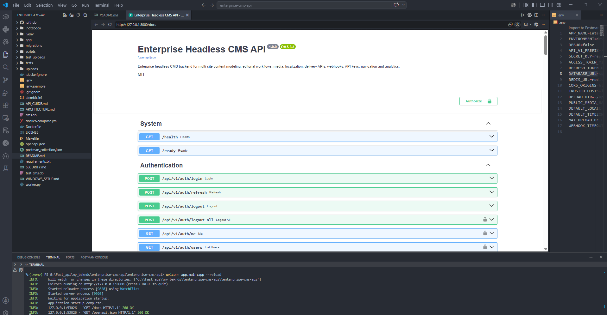

# Enterprise Headless CMS API

A production-oriented FastAPI backend for building multi-site websites, documentation portals, newsrooms, marketing platforms, application content hubs and omnichannel content systems.


## Core capabilities

- JWT access tokens and rotating refresh-token families
- Refresh-token reuse detection and family revocation
- Argon2 password hashing and account lockout
- Platform roles and per-site editorial roles
- Multi-site workspaces, environments and locales
- JSON-based custom content-type schemas
- Field-level content validation
- Draft, review, approval, rejection, publication, scheduling and archival
- Optimistic concurrency through `expected_version`
- Immutable content revisions and revision restore
- SEO metadata, tags, comments and editorial collaboration
- Local development media uploads with checksums and metadata
- Navigation menus, nested menu items and redirects
- Scoped API keys for delivery integrations
- Signed webhook endpoints and durable delivery records
- Public content-delivery and preview APIs
- Dashboard, publishing calendar, content-health and audit reports
- PostgreSQL and SQLite support
- Alembic, Redis, Celery, Docker Compose, GitHub Actions, OpenAPI and Postman

## Verified project contract

- 96 API operations
- 69 API paths
- 52 OpenAPI schemas
- 21 application tables
- 10 site roles and 6 platform roles
- 3 automated lifecycle tests

## Architecture

```text
Web Admin / Mobile Admin / External Integrations
                     |
               FastAPI REST API
                     |
     +---------------+----------------+
     |               |                |
 Authentication   CMS Domain      Delivery API
     |               |                |
 PostgreSQL      Media Storage      CDN / Frontend
     |
 Redis + Celery workers
     |
 Scheduled publishing + webhook delivery
```

## Local setup

### Windows PowerShell

```powershell
py -3.12 -m venv .venv
.\.venv\Scripts\Activate.ps1
pip install -r requirements.txt
Copy-Item .env.example .env
```

For SQLite development, set these values in `.env`:

```env
DATABASE_URL=sqlite:///./cms.db
REDIS_URL=
TRUSTED_HOSTS=localhost,127.0.0.1,testserver
UPLOAD_DIR=./uploads
PUBLIC_MEDIA_BASE_URL=http://127.0.0.1:8000/media
```

Run the database and seed data:

```powershell
alembic upgrade head
python -m scripts.seed
uvicorn app.main:app --reload
```

Open:

- Swagger: http://127.0.0.1:8000/docs
- ReDoc: http://127.0.0.1:8000/redoc
- Health: http://127.0.0.1:8000/health
- Readiness: http://127.0.0.1:8000/ready

## Docker Compose

```bash
cp .env.example .env
docker compose up --build
```

Seed the Docker database:

```bash
docker compose exec api python -m scripts.seed
```

The Compose stack includes PostgreSQL, Redis, API, Celery worker and Celery Beat.

## Demo users

All seeded users use `Password@123`.

| Responsibility         | Email                       |
| ---------------------- | --------------------------- |
| Super administrator    | `admin@cms.example.com`     |
| Platform administrator | `platform@cms.example.com`  |
| Auditor                | `auditor@cms.example.com`   |
| Developer              | `developer@cms.example.com` |
| Editor                 | `editor@cms.example.com`    |
| Author                 | `author@cms.example.com`    |
| Reviewer               | `reviewer@cms.example.com`  |
| Media manager          | `media@cms.example.com`     |

## Important workflows

### Editorial publishing

```text
Draft -> In Review -> Approved -> Published
                   -> Rejected -> Draft
Approved -> Scheduled -> Published
Published -> Unpublished/Approved
Any managed entry -> Archived
```

### Delivery integration

1. Create a site and production environment.
2. Define and publish a content type.
3. Create, review and publish entries.
4. Create a scoped API key with `delivery:read`.
5. Consume `/api/v1/delivery/sites/{site_key}/...`.
6. Configure webhooks for cache purge, deployment or search indexing.

## Production adaptation

The included storage adapter writes files locally for development. Production systems should use S3, Cloudflare R2, Azure Blob Storage or Google Cloud Storage, with malware scanning, image processing and a CDN. Webhook delivery is represented with durable database records; connect the worker to a real HTTP provider adapter and enforce private-network protections before production use.

See `SECURITY.md`, `ARCHITECTURE.md`, `API_GUIDE.md` and `WINDOWS_SETUP.md` for more detail.
